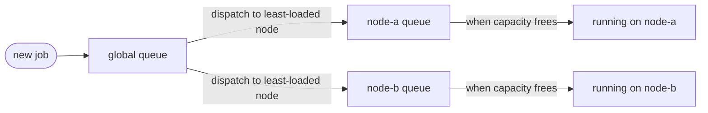
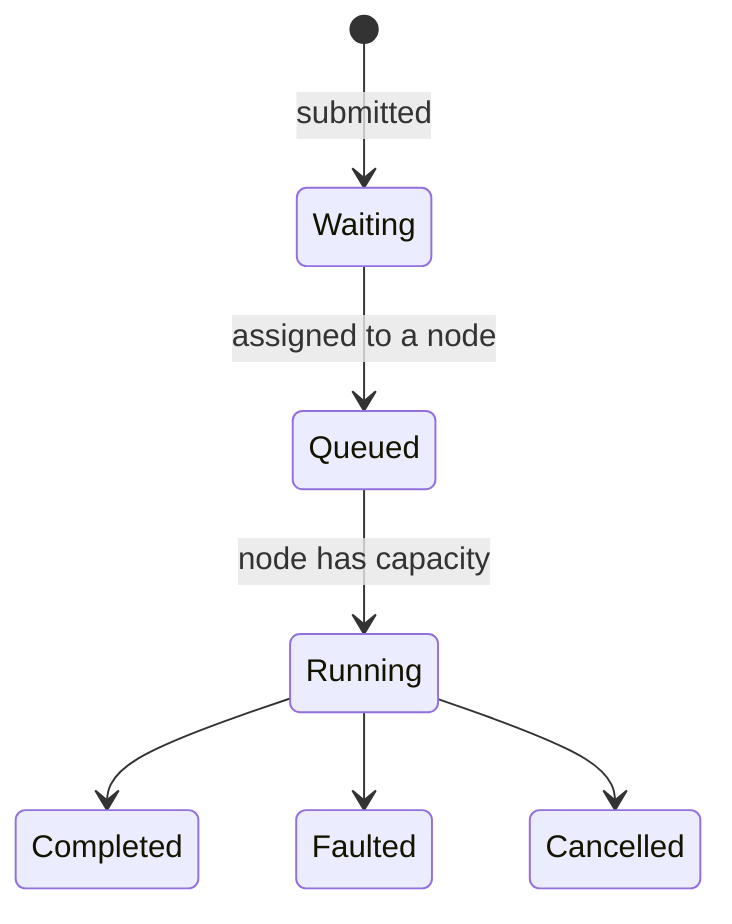
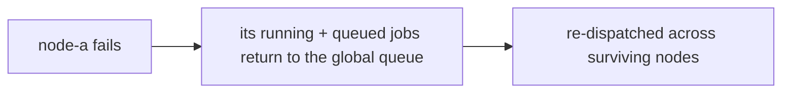

# Custom job scheduling on Akka.NET

A small cluster that schedules long-running jobs across worker nodes. You submit a job with a size in work units; the cluster decides where it runs, keeps it running through node failures, and streams progress back to you.

It's built to be read. The scheduling logic is a pure state machine you can test without a cluster, and the wire format is plain JSON you can read straight out of the journal.

## Run it

```powershell
dotnet run --project src/Akka.CustomJobScheduling.AppHost
```

You need the .NET 10 SDK (pinned in `global.json`) and a Docker-compatible runtime for Redis. The Aspire dashboard comes up with three worker replicas, one API node, and Redis. Open the API node's HTTP endpoint and you land on a live dashboard at `/`: capacity per node, a job table, and a box to submit jobs by hand.

## How scheduling works

One actor, the JobTracker, is the source of truth. It's a cluster singleton, so there's exactly one of it however many nodes you run, and every job flows through it.

A job lands in a global queue, gets assigned to a node, and waits in that node's queue until the node has room to run it:



The dispatch step is the one that matters. A job that needs a whole node doesn't block the queue behind it. It drops into one node's queue and waits there, while smaller jobs get sent to other nodes and start right away. The tracker picks the least-loaded node that's big enough, so work spreads out on its own.

Here's a job's whole life:



Progress runs the other way. As a job executes, its node reports back, the tracker records it, and everyone subscribed - the dashboard, an SSE client, the original submitter - gets the update pushed to them.

## When a node fails

Two things can fail, and they're handled differently.

A worker node dies. Everything it was carrying - jobs that were running and jobs still waiting in its queue - goes back to the global queue and gets redistributed across the survivors. Previously-running work reschedules first, so in-flight jobs reclaim capacity ahead of jobs that never started.



The node hosting the tracker dies. The singleton moves to another node and rebuilds its state by replaying its journal from Redis - every decision it ever made, in order. It also reconciles against live cluster membership, because a node that left while the tracker was down never sent a "leaving" message the replay could see. Anything gone gets dropped, and its work requeued, before new placement happens.

Nothing runs on a node the tracker hasn't recorded first. Commands go to the journal, then get acted on, so a tracker that crashes mid-decision comes back knowing exactly what it had committed to.

One deliberate call: an unreachable node keeps its jobs. The cluster waits until a node is actually removed before requeueing, because a node on the far side of a healing network partition is still running its work. Requeue on a blip and you'd run the same job twice.

## When it scales

Add worker replicas and you add capacity. The AppHost runs three; change the replica count and the tracker starts placing work on the new nodes as they join. Dispatch already balances across whatever's there.

The singleton isn't the bottleneck it sounds like. It makes placement decisions and records events. It doesn't run jobs or move their data - the workers do that, in parallel. The submitters are cluster-sharded and the per-node work is independent, so the parts that actually carry load scale out on their own; the tracker just coordinates.

The API scales separately. It runs under its own `api` role, holds no jobs, and reaches the tracker and submitters through proxies, so you can run more API nodes for more HTTP and SSE throughput without touching the workers.

## API

| | | |
| --- | --- | --- |
| `POST` | `/jobs` | `{"id":"...","size":25,"submitterId":"..."}` -> `202` + `Location` |
| `GET` | `/jobs` | All jobs; `?includeFinished=false&limit=50` |
| `GET` | `/jobs/{id}` | Current status |
| `GET` | `/jobs/{id}/events` | Server-sent events until that job finishes |
| `DELETE` | `/jobs/{id}?submitterId=...&reason=...` | Cancel |
| `GET` | `/cluster/queue` | Queue depth and per-node capacity |
| `GET` | `/cluster/events` | Server-sent events for the whole queue |

Rejections map onto status codes: duplicate id `409`, unknown job `404`, already finished `409`, wrong submitter `403`. A job larger than any node isn't rejected - it's accepted and runs on a whole node to itself.

## Layout

- `Akka.CustomJobScheduling.Core` - the domain model, the scheduling state machine, and the actors.
- `Akka.CustomJobScheduling` - a worker. Joins as `worker`, hosts the tracker singleton and a job receiver.
- `Akka.CustomJobScheduling.Api` - the HTTP surface and dashboard. Joins as `api`, runs no jobs.
- `Akka.CustomJobScheduling.AppHost` - the Aspire host. Provisions Redis, starts the workers and the API.

For how it's built inside - the state-machine split, the message taxonomy, the serializer, streaming, and the test setup - see [docs/ARCHITECTURE.md](docs/ARCHITECTURE.md).

## Build and test

```powershell
dotnet build Akka.CustomJobScheduling.slnx
dotnet test Akka.CustomJobScheduling.slnx
```
