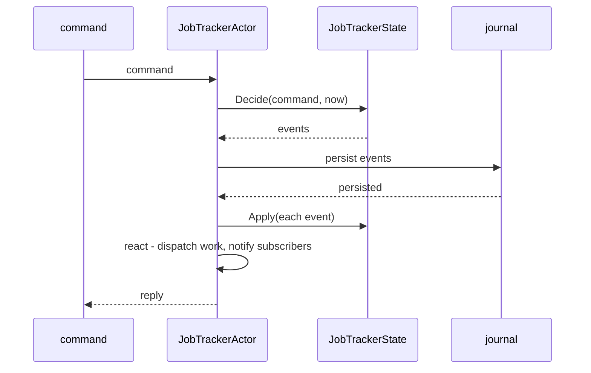
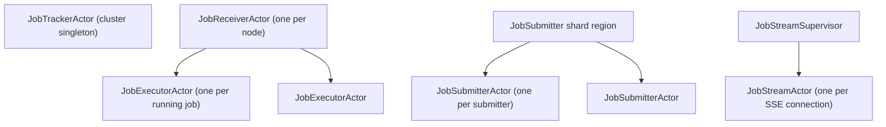
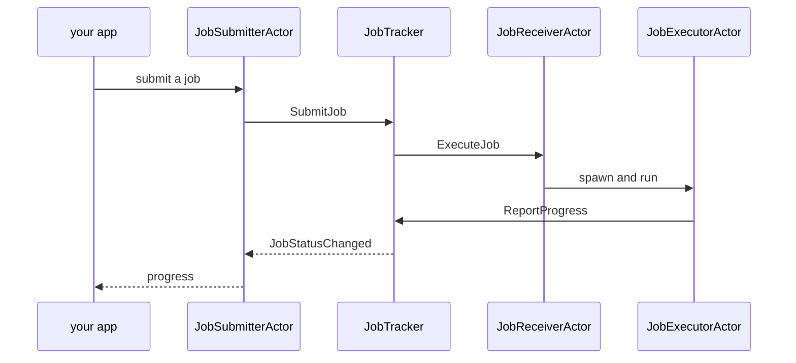

# Architecture

How the scheduler is built, for someone about to work in the code. For the outside view - what it does and how it behaves - start with the [README](../README.md).

## State, separated from the actors

The scheduling logic doesn't live in an actor. It lives in `JobTrackerState`, a plain immutable record with three operations. The type of the input decides which one runs:

- `Decide(command, now)` takes a command - submit or cancel - validates it, and returns the events it implies or a rejection. The only place a "no" can come from.
- `Integrate(fact, now)` takes a fact - a worker's progress, a node leaving - and returns the events it implies. It never rejects; a stale fact just returns nothing.
- `Apply(event)` folds one committed event into a new state. Pure, per-type, and the only thing that runs on recovery.

That's the whole brain of the system - placement, capacity accounting, requeue-on-failure, all of it. It holds no `IActorRef`, never reads the clock (time comes in as an argument), and has no side effects. So you test it like any other function: build a state, hand it a command or a fact, check the events that come back. No `ActorSystem`, no `TestKit`, no `await`.

`JobTrackerActor` is the shell that wires that logic to the outside world:

Read the clock, decide, persist, fold, react. The actor stays thin on purpose, so the part that's actually hard to get right - the scheduling rules - stays testable in isolation. A fact takes the same road but enters through `Integrate` instead of `Decide`, and there's no reply at the end: a fact can't be refused, so nobody's waiting on a yes or no.

## The message taxonomy

Messages are grouped by their role, not by what they carry:

| Kind | What it is |
| --- | --- |
| Commands | Requests - submit, cancel. Validated, and the only messages that can be rejected. |
| Facts | Things that already happened, reported from outside - a worker's progress, a node joining or leaving. Never rejected; a stale one implies no events. |
| Events | What the tracker commits to its journal. This is the persisted schema. |
| Queries | Read-only, including subscriptions. |
| Notifications | The contract pushed out to subscribers and submitters. |

The line between commands and facts is the one to get right. A command is a request that can be told no; a fact already happened and can only be folded in. Rejection lives on one side and never the other, and the return types enforce it - `Decide` can hand back a rejection, `Integrate` structurally cannot. The split between events and notifications earns its keep too: events are the internal record we write to the journal, notifications are the public shape we hand to subscribers, so we can change how state is stored without breaking anyone listening.

## The actors

Four actor types. The tracker is the only one that decides anything; the rest feed it work or carry out what it decided.

Three of them share one shape worth copying - a parent that spawns a child per unit of work:

The receiver spawns an executor per job, the shard region holds an entity per submitter, and the stream supervisor holds a bridge per open connection. Same pattern three times: a supervisor that owns one short-lived child per thing it's tracking, so a child that fails or finishes takes nothing else down with it.

Here's how a message travels through them - a job going in, progress coming back:

A submission hits a `JobSubmitterActor` first - a sharded entity, one per submitter id - which forwards it to the tracker. The tracker picks a node and tells that node's `JobReceiverActor` to run the job. The receiver spawns an executor, and the executor reports progress straight back to the tracker, which pushes each change to whoever's subscribed, the submitter included. Routing through the submitter (rather than the client talking to the tracker directly) is what keeps a submitter reachable by id after the tracker recovers and every old `IActorRef` is stale.

If you're adapting this, that's the skeleton to lift. The executor here just runs a `Task.Delay` loop, since the point is the scheduling and not the work - swap it for whatever your jobs actually do and the rest of the structure stands.

## Persistence and recovery

The tracker is a `ReceivePersistentActor` on a fixed persistence id. Fixed, because a singleton that fails over to another host has to resume the same event stream. Snapshots every 200 events keep replay bounded; the journal is still the source of truth.

Recovery has one subtlety worth spelling out. Replaying the journal faithfully restores nodes that were present when the events were written - including a node that has since left. No `MemberRemoved` is coming for that node, because the message went to a tracker that no longer exists. So on startup the tracker reconciles: the membership source hands it the current member set, it drops whatever's gone, and it requeues that node's work before placing anything new.

## Serialization

`JobSchedulingSerializer` is a `SerializerWithStringManifest` built on System.Text.Json with a source-generated context. A journal entry is readable JSON.

Types map to short, stable manifest strings (`e:job-accepted`, `c:submit-job`) rather than .NET type names, so a class can be renamed or moved between namespaces without orphaning events already on disk. Five converters handle what JSON doesn't do on its own: `Address` and `JobId` as strings and as dictionary keys, `JobSize` as a number, `IActorRef` as its serialized actor path (the converter holds the `ActorSystem`, so a subscription sent from another node round-trips to a usable reference), and enums as their names.

Evolution is whatever System.Text.Json does: a reader ignores fields it doesn't recognize and defaults ones that are missing. Add a field to a record and old journal entries still load.

One type is left out on purpose. `JobStreamMessages` carries a `ChannelReader` and a live child `IActorRef` - it's in-process by construction and must never travel. Leaving it unregistered turns an accidental remote send into a loud failure instead of quiet corruption.

## Streaming progress

An HTTP response isn't an `IActorRef`, so each SSE connection gets a short-lived bridge actor. `JobStreamSupervisor` spawns one per connection; the bridge subscribes to the tracker, writes each update into a bounded channel, and completes the channel when the job finishes, so the endpoint's `await foreach` ends on its own.

The channel drops its oldest entry when a client falls behind. That's only safe because every notification carries absolute progress, not a delta: a client that misses 40% then 50% is still correct the moment it sees 60%.

## Testing

Two suites, split on purpose.

`Core.Tests` exercises the scheduling rules directly - no `ActorSystem`, no `TestKit`, no `await`. Because the rules are a pure function, this is where the hard cases live: head-of-line avoidance, reschedule ordering, capacity accounting when a node dies.

`Actors.Tests` exercises the actors. Cluster membership sits behind `IClusterMembershipSource`, so a test stands up several worker nodes in one process, downs one mid-job, and asserts the work migrates, with no remoting involved. A smaller suite runs the same registration code against a real single-node cluster, so the local-mode and clustered-mode paths can't drift apart.
